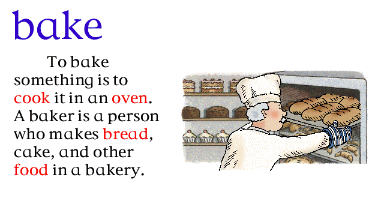
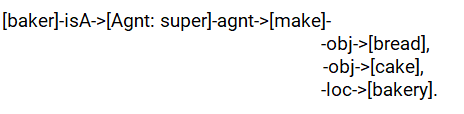

# Amazing-Dictionary
An amazing dictionary realized with an ontology and graph conceptuels in Amine Platform which take each image and describe its content with graph conceptuels. And in this project, I work on 10 images.

# Requirement
1. Java 
2. Amine Platform (A Java Open Source Platform for Development of Intelligent Systems & Multi-Agent Systems) : [Download](https://sourceforge.net/projects/amine-platform/)

# 

If we take for example this image:

1. First of all, we should add the necessary words to our ontology which are: **oven**, **bake**, **cook**, **baker**, **make**, **bread**, **cake** and **bakery**.
2. The second think is to find out the main words that we should define them with conceptual graphs. 
3. The third think is to find out the relationship between them.
4. After that, we write our conceptual graph.
>For example this graph below represent the agent **Baker**:
>
>
>
5. And Finally, we copyed the graph in the platform and we see the result by following the steps below:

### Step 1:

### Step 2:

### Step 3:

### Step 4:

### Step 5:

